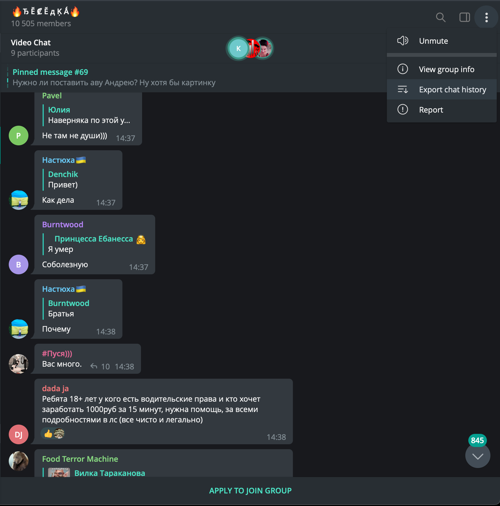

# PyCon 2022, Мастер-класс "Как сделать свою генеративную болталку"
 
### Как получить сырые данные из телеграма

В настройках выгрузки нужно выбрать формат джсон и убрать галочки со всех медиа файлов. Тк данные могут скачиваться долго в репозитории лежит пример выгруженных данных.

### Как распарсить данные

`python cli/prepare_messages.py --tg-history-path 'chata_export.json' --output-path 'data.csv'`

### Как получить спец токен для бота

В телеграме идём к https://t.me/BotFather, просим сделать нового бота, забираем секретный токен

### Как поднять бота

`TG_BOT_TOKEN='secrettoken' python tg_bot/bot.py`
